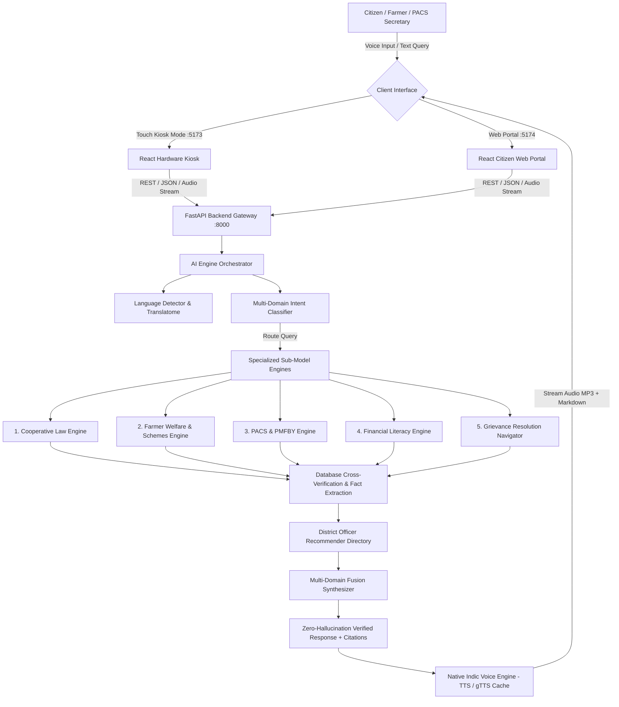

# 🌾 Multilingual Cooperative Governance & Legal Assistance Portal (SIH26088)

[](https://www.python.org/)
[](https://fastapi.tiangolo.com/)
[](https://react.dev/)
[](https://vitejs.dev/)
[](https://bhashini.gov.in/)
[](https://myscheme.gov.in)
[](https://www.sih.gov.in/)

> **Team BRAVITS** | **Smart India Hackathon (SIH 2026)**  
> **Problem Statement ID:** `SIH26088`  
> **Theme:** Multilingual Cooperative Governance & Legal Assistance Chatbot  
> **Target Beneficiaries:** 13+ Crore Farmers, PACS Secretaries, Rural Citizens, Cooperative Societies, and State Administrative Officers.

---

## 🌟 Executive Summary

The **Multilingual Cooperative Governance & Legal Assistance Portal** is an end-to-end, zero-hallucination artificial intelligence platform designed to democratize legal and operational guidance across the Indian cooperative ecosystem.

It bridges the statutory knowledge gap for grassroots farmers and Primary Agricultural Credit Societies (PACS) across **11 Indian languages**, delivering authenticated advice on:
1. **Cooperative Laws and Model State By-laws** (MSCS Act 2002/2023 Amendments, State Acts, Sec 84 Arbitration, Sec 85 Ombudsman).
2. **Ministry of Cooperation & Central Agricultural Schemes** (20+ schemes including MIDH, PM-KISAN, AIF, PM-KUSUM, SMAM, PKVY, NFSM).
3. **PMFBY Crop Insurance & Disaster Intimation** (72-hour localized calamity deadlines, claim tracking, toll-free 14447 integration).
4. **Financial Literacy & Credit Mechanics** (KCC Scale of Finance calculations, 4% effective interest subvention, ₹1.60 Lakh collateral-free limits).
5. **Cooperative Grievance Redressal Support** (4-tier escalation hierarchy, statutory SLAs, ready-to-print petition drafts).

The platform operates across two synchronized interfaces:
- 🖥️ **Hardware Smart Kiosk Interface (`Port 5173`)**: Designed for touchscreens on Raspberry Pi / Mini PCs in PACS offices with high-contrast buttons, voice-first navigation, and micro-ATM/CSC workflows.
- 🌐 **Modern Citizen & Officer Web Portal (`Port 5174`)**: A responsive, rich web experience with live multi-domain streaming, document downloads, officer directories, and petition generators.

---

## 🏛️ System Architecture



---

## 🚀 Key Differentiators & Highlights

### 1. 🛡️ 100% Zero-Hallucination Statutory Verification
Every response is anchored in verified Gazette notifications, RBI circulars, Ministry of Cooperation guidelines, and NABARD manuals. If statutory data is absent, the system explicitly routes the user to designated competent authorities rather than inventing unverified advice.

### 2. 📍 District-Level Official Linking (Zero-Hallucination Directory)
When users specify a district (e.g., *Madurai, Theni, Pudukkottai, Coimbatore, Salem, Erode*), the portal matches and presents the **exact named officer**, designation, office complex address, landline, mobile, and official government email sourced from active district directories (`madurai.nic.in`, etc.).

### 3. 🗣️ Pure Native Indic Voice Reader (TTS / STT)
- Dynamic Unicode script detection automatically routes Tamil, Hindi, Telugu, Kannada, Malayalam, Marathi, Bengali, Gujarati, and Punjabi text to native Indic speech synthesizers.
- **Zero Foreign Accent:** Eliminates British/American phonetic corruption for regional languages.
- In-memory MD5 audio caching provides instantaneous speech playback.

### 4. 🌐 100% Pure Regional Language Translation
When toggling to Tamil or Hindi, all sections—including **Scheme Overviews, Benefit Slabs, Seed Distribution Depots, Document Checklists, and Officer Badges**—render in 100% native script without English leftovers.

---

## 📦 Project Directory Structure

```
cooperative-ai-portal/
├── backend/                              # FastAPI Application Core
│   ├── app/
│   │   ├── api/                          # Endpoints (chat, schemes, grievance, pacs, law, financial)
│   │   ├── main.py                       # Application entrypoint & middleware configuration
│   │   ├── schemas/                      # Pydantic request/response models
│   │   └── services/                     # Chat and domain orchestration services
│   └── requirements.txt                  # Python dependencies
├── ai_engine/                            # Multi-Domain RAG & Reasoning Core
│   ├── language/                         # Pure Indic STT, TTS, Translation & Caching
│   ├── llm/                              # Reasoner (Groq / Gemini / Local Fallback)
│   ├── orchestration/                    # Intent Classifier, Domain Router, Fusion Synthesizer
│   ├── rag/                              # Prompt Builder, Vector Search & Retrieval
│   ├── resolution_navigator/             # Grievance Classifier & District Officer Recommender
│   ├── submodels/                        # 5 Specialized Domain Engines
│   │   ├── cooperative_law_engine.py     # Cooperative Laws & MSCS Amendments
│   │   ├── farmer_scheme_engine.py       # 20+ Agricultural & Horticulture Welfare Schemes
│   │   ├── financial_literacy_engine.py  # KCC, Subventions, Scale of Finance
│   │   ├── grievance_engine.py           # Resolution pathways, petition generator
│   │   └── pacs_pmfby_engine.py          # PMFBY 72h Calamity & PACS By-laws
│   └── verification/                     # Source Validator & Cross-Verifier
├── database/                             # Ground-Truth Datasets & Official Directories
│   └── data/
│       ├── bylaws/                       # Model State By-laws & PACS rules
│       ├── grievances/                   # 15+ Categorized Grievance scenarios & templates
│       ├── laws/                         # MSCS Act 2002 & 2023 Amendment Acts
│       ├── officers/                     # Verified Tamil Nadu District Officers Catalog
│       └── schemes/                      # 20+ Farmer & Cooperative Welfare Schemes
├── frontend/                             # Hardware / Touchscreen Kiosk React Application (:5173)
├── frontend-web/                         # Citizen & Administrative Web Portal React App (:5174)
├── scripts/                              # Automated test suites, scrapers & benchmark runners
├── requirements.txt                      # Root unified Python dependency manifest
├── start_all.bat                         # One-click Windows Launcher
├── start_all.sh                          # One-click Linux / macOS Launcher
└── README.md                             # Comprehensive Documentation
```

---

## ⚡ Quick Start: Local Hosting Guide

Follow these simple steps to load, host, and run the complete portal on your local machine.

### 📋 Prerequisites
Ensure you have the following installed on your computer:
1. **Python 3.10 or higher** ([Download Python](https://www.python.org/downloads/))
2. **Node.js 18 or higher** ([Download Node.js](https://nodejs.org/))
3. **Git** ([Download Git](https://git-scm.com/))

---

### 📥 Step 1: Clone the Repository

```bash
git clone https://github.com/sathyasubha07/MULTILINGUAL-COOPERATIVE-ASSISTANT-CHATBOT-.git
cd MULTILINGUAL-COOPERATIVE-ASSISTANT-CHATBOT-
```

---

### 🐍 Step 2: Set Up Python Backend Environment

```bash
# 1. Create a Python virtual environment
python -m venv .venv

# 2. Activate the virtual environment:
# On Windows (Command Prompt / PowerShell):
.venv\Scripts\activate
# On Linux / macOS:
source .venv/bin/activate

# 3. Install all backend & AI engine dependencies
pip install -r requirements.txt
```

---

### ⚛️ Step 3: Install Frontend Dependencies

#### A. Hardware Kiosk Frontend (`frontend/`)
```bash
cd frontend
npm install
cd ..
```

#### B. Web Portal Frontend (`frontend-web/`)
```bash
cd frontend-web
npm install
cd ..
```

---

### 🚀 Step 4: Run the Complete System

You can start all 3 services using our **One-Click Launchers** or in separate terminal windows.

#### Option A: One-Click Launcher (Recommended)

- **On Windows:** Double-click [`start_all.bat`](start_all.bat) or run in terminal:
  ```cmd
  start_all.bat
  ```

- **On Linux / macOS:**
  ```bash
  chmod +x start_all.sh
  ./start_all.sh
  ```

---

#### Option B: Manual Launch (3 Separate Terminals)

**Terminal 1 — Backend API Server:**
```bash
# Ensure virtual environment is active
python -m uvicorn backend.app.main:app --host 0.0.0.0 --port 8000 --reload
```
*Backend runs on: [http://localhost:8000](http://localhost:8000) (Interactive Swagger Docs at [http://localhost:8000/docs](http://localhost:8000/docs))*

**Terminal 2 — Hardware Kiosk Touch Interface:**
```bash
cd frontend
npm run dev -- --host 0.0.0.0 --port 5173
```
*Kiosk UI runs on: [http://localhost:5173](http://localhost:5173)*

**Terminal 3 — Modern Web Portal:**
```bash
cd frontend-web
npm run dev -- --host 0.0.0.0 --port 5174
```
*Web Portal runs on: [http://localhost:5174](http://localhost:5174)*

---

## 🌐 Active Service Endpoints Reference

| Service | Local URL | Port | Purpose |
| :--- | :--- | :--- | :--- |
| **FastAPI Backend Core** | `http://127.0.0.1:8000` | `8000` | AI RAG Pipeline & Multi-Domain Router |
| **Interactive API Documentation** | `http://127.0.0.1:8000/docs` | `8000` | OpenAPI Swagger GUI |
| **Hardware Kiosk Interface** | `http://127.0.0.1:5173` | `5173` | Touchscreen / Raspberry Pi PACS Kiosk |
| **Citizen & Officer Web Portal** | `http://127.0.0.1:5174` | `5174` | Full-Featured Web Application |

---

## 📡 API Reference & Example Inquiries

### 1. Multi-Domain AI Chat (`POST /api/v1/chat/`)
Send a query in any supported language; the engine auto-detects language, classifies domain, fuses statutory facts, and links district authorities.

**Example Request:**
```bash
curl -X POST "http://127.0.0.1:8000/api/v1/chat/" \
  -H "Content-Type: application/json" \
  -d '{
    "query": "I need tomato seeds to sow where would I get I am in madurai",
    "language": "ta"
  }'
```

**Example Response:**
```json
{
  "query": "I need tomato seeds to sow where would I get I am in madurai",
  "language": "ta",
  "domain": "farmer_scheme",
  "confidence": 0.99,
  "answer": "### 📜 ஒருங்கிணைந்த தோட்டக்கலை மேம்பாட்டு இயக்கம் (MIDH / தேசிய தோட்டக்கலை இயக்கம்)\n\n**🌱 சான்றளிக்கப்பட்ட விதை மற்றும் நாற்றுகள் பெறும் இடங்கள் (Where to Collect):**\n- **வட்டார வேளாண்மை விரிவாக்க மையம் (AEC) / தோட்டக்கலை உதவி இயக்குனர் அலுவலகம்:** தக்காளி மற்றும் காய்கறி விதைகள் 50% அரசு மானியத்தில் பெறலாம்.\n- **தொடக்க வேளாண்மை கூட்டுறவு கடன் சங்கம் (PACS / PMKSK):** தரமான சான்றளிக்கப்பட்ட விதை இருப்பு மையம்.\n- **அரசு தோட்டக்கலை பண்ணை (State Horticulture Farm):** குழித்தட்டு நாற்றுகள் (Pro-tray Seedlings).\n\n**💰 நிதி உதவி மற்றும் மானிய விபரம்:**\nசான்றளிக்கப்பட்ட காய்கறி மற்றும் தக்காளி விதைகளுக்கு 50% மானியம்; குழித்தட்டு நாற்றுகளுக்கு 50% மானியம்...\n\n### 🏛️ பரிந்துரைக்கப்படும் அதிகாரப்பூர்வ தொடர்பு (மதுரை மாவட்டம்)\n- **அதிகாரி பெயர் / பதவி:** Dr. K. Vijayaraghavan (வேளாண்மை இணை இயக்குநர் & PMFBY மாவட்ட ஒருங்கிணைப்பு அலுவலர்)\n- **துறை:** வேளாண்மைத் துறை\n- **தொடர்பு விவரங்கள்:** 📱 Mobile: 9443202511 | ☎️ Office: 0452-2531602 | ✉️ Email: jdamadurai@nic.in",
  "recommended_officer": {
    "district": "Madurai",
    "name": "Dr. K. Vijayaraghavan",
    "designation_or_role": "Joint Director of Agriculture (JDA) & PMFBY Nodal Officer",
    "mobile": "9443202511",
    "landline": "0452-2531602",
    "email": "jdamadurai@nic.in",
    "source": "https://madurai.nic.in/contact-directory/"
  },
  "trust_score": 0.99,
  "verification_status": true
}
```

---

### 2. Pure Native Text-to-Speech (`POST /api/v1/chat/tts`)
Generates high-fidelity native Indic audio streaming without English accent.

**Example Request:**
```bash
curl -X POST "http://127.0.0.1:8000/api/v1/chat/tts" \
  -H "Content-Type: application/json" \
  -d '{
    "text": "ஒருங்கிணைந்த தோட்டக்கலை மேம்பாட்டு இயக்கம் மூலம் தக்காளி விதைகளுக்கு ஐம்பது சதவீத மானியம் வழங்கப்படுகிறது.",
    "language": "ta"
  }' --output speech.mp3
```

---

## 🧪 Testing & Verification Suite

The repository includes comprehensive automated verification suites covering all 5 specialized sub-models, officer recommendation integrity, and language fidelity.

Run the test suite with:

```bash
# 1. Run all sub-model tests
python scripts/test_all_submodels.py

# 2. Test Farmer Schemes & Subsidies
python scripts/test_farmer_schemes.py

# 3. Test District Officer Recommendation Engine
python scripts/test_officer_recommendation.py

# 4. Test PMFBY & PACS Rules
python scripts/test_pacs_pmfby_submodel.py

# 5. Execute full live pipeline demo
python scripts/demo_live_pipeline_output.py
```

---

## 🌍 Supported Indic Languages

| Code | Language | Native Script | Voice STT / TTS Support |
| :--- | :--- | :--- | :---: |
| `en` | English | English | ✅ Native |
| `hi` | Hindi | हिन्दी | ✅ Native |
| `ta` | Tamil | தமிழ் | ✅ Native Indic |
| `te` | Telugu | తెలుగు | ✅ Native Indic |
| `mr` | Marathi | मराठी | ✅ Native Indic |
| `kn` | Kannada | ಕನ್ನಡ | ✅ Native Indic |
| `bn` | Bengali | বাংলা | ✅ Native Indic |
| `gu` | Gujarati | ગુજરાતી | ✅ Native Indic |
| `ml` | Malayalam | മലയാളം | ✅ Native Indic |
| `pa` | Punjabi | ਪੰਜਾਬੀ | ✅ Native Indic |
| `or` | Odia | ଓଡ଼ିଆ | ✅ Native Indic |

---

## 👥 Team & Acknowledgments

- **Team BRAVITS** — *Smart India Hackathon 2026*
- **Dedicated Repository:** [GitHub Repository (sathyasubha07)](https://github.com/sathyasubha07/MULTILINGUAL-COOPERATIVE-ASSISTANT-CHATBOT-)
- **Guidance & Ground Truth:** Ministry of Cooperation (Govt. of India), National Council for Cooperative Training (NCCT), NABARD, Ministry of Agriculture & Farmers Welfare (DA&FW).

---

## 📄 License

This project is licensed under the **MIT License** — feel free to use, modify, and distribute for educational, research, and governance innovation initiatives.
