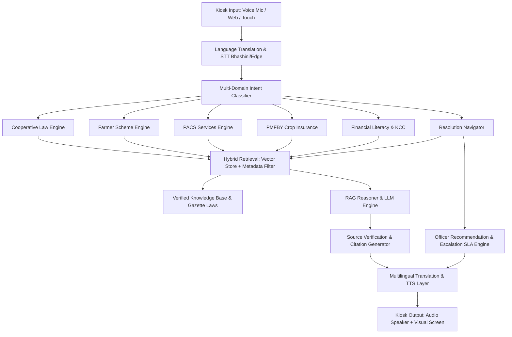

# Technical Architecture: Multilingual Cooperative AI Assistant (Team BRAVITS)
**Smart India Hackathon 2026 | Problem Statement ID: SIH26088**

## 1. System Overview
The Multilingual Cooperative Assistant is an end-to-end hardware-software AI platform designed to empower rural citizens, PACS secretaries, and farmers with verified statutory guidance on:
1. **Multi-State Cooperative Societies Act & State Bylaws**
2. **Pradhan Mantri Fasal Bima Yojana (PMFBY)**
3. **Primary Agricultural Credit Societies (PACS) Multi-Service Hubs**
4. **Government Schemes (PM-KISAN, AIF, KCC)**
5. **Resolution Navigator for Public Grievance Escalation**

## 2. Architectural Blueprint

## 3. Key Differentiators
- **100% Offline Edge Capability**: Capable of executing on Raspberry Pi / Mini PC without continuous cellular connectivity.
- **Strict Verification & Zero Hallucination**: Every output references official acts, rules, or circulars.
- **Resolution Navigator**: Guides farmers to the exact officer, office address, SLA, and document checklist with auto-escalation pathways.
